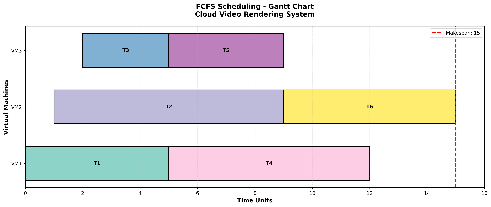
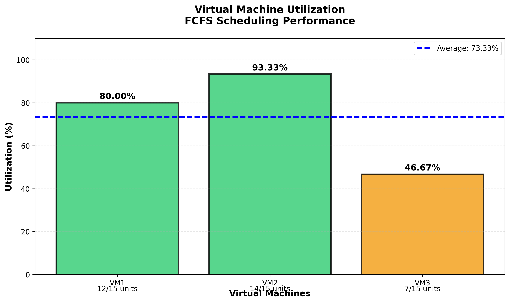

# FCFS Cloud Video Rendering Task Scheduling System

## 📋 Project Overview

This project simulates a **cloud-based operating system scheduler** using the **First Come First Served (FCFS)** algorithm to manage video rendering tasks across multiple Virtual Machines (VMs).

### Real-World Context
In cloud platforms like AWS, Google Cloud, or Azure, thousands of rendering jobs are submitted by users. The operating system must decide:
- Which task runs first
- On which VM it should execute
- How efficiently system resources are used

This project models that behavior using Python and core OS scheduling concepts.

---

## ✅ Requirements Fulfillment

| Requirement | Status | Implementation |
|------------|--------|----------------|
| FCFS Scheduling Algorithm | ✅ | Tasks executed strictly in arrival order |
| 5-6 Tasks | ✅ | 6 video rendering jobs simulated |
| 2-3 Virtual Machines | ✅ | 3 VMs handling tasks concurrently |
| Order of Arrival | ✅ | Tasks sorted by arrival time |
| Track Makespan | ✅ | Total completion time calculated |
| Track VM Utilization | ✅ | Busy time vs makespan calculated |
| Realistic Scenario | ✅ | Cloud video rendering system |
| OS Concepts Applied | ✅ | Scheduling, resource allocation, metrics |

---

## 🏗️ Project Structure

```
fcfs_scheduler/
│
├── task.py                  # Task class (video rendering job)
├── virtual_machine.py       # VirtualMachine class (VM resource)
├── scheduler.py             # FCFS scheduling algorithm
├── visualizer.py            # Gantt charts and graphs
├── main.py                  # Application entry point
├── requirements.txt         # Python dependencies
└── README.md               # This file
```

---

## 🚀 Installation & Usage

### Prerequisites
- Python 3.8 or higher
- pip package manager

### Step 1: Install Dependencies
```bash
cd fcfs_scheduler
pip install -r requirements.txt
```

### Step 2: Run the Simulation
```bash
python main.py
```

### Expected Output
1. **Console Output:**
   - Task execution order
   - Start and completion times
   - Performance metrics (makespan, utilization, waiting time)
   - Task execution table

2. **Visual Output:**
   - `gantt_chart.png` - Timeline of task execution across VMs
   - `vm_utilization.png` - Bar chart showing VM utilization percentages

---

## 📊 How It Works

### 1. Task Creation
Each video rendering task has:
- **Task ID** (e.g., T1, T2, ...)
- **Arrival Time** (when task is submitted)
- **Burst Time** (CPU time required to render)

Example:
```python
Task('T1', arrival_time=0, burst_time=5)
```

### 2. FCFS Scheduling
- Tasks are sorted by **arrival time**
- Earliest arriving task is scheduled first
- **No preemption** (task cannot be interrupted)

### 3. VM Assignment
- System has 2-3 VMs
- Each task is assigned to the **earliest available VM**
- This simulates **load balancing** in cloud systems

### 4. Execution Simulation
For each task:
- **Start Time** = max(arrival time, VM available time)
- **Completion Time** = start time + burst time
- VM available time is updated

### 5. Performance Metrics

#### Makespan
Total time to complete all tasks:
```
Makespan = max(VM1_end_time, VM2_end_time, VM3_end_time)
```

#### VM Utilization
Percentage of time VM was busy:
```
Utilization = (Total Busy Time / Makespan) × 100%
```

#### Waiting Time
Time task waited before execution:
```
Waiting Time = Start Time - Arrival Time
```

#### Turnaround Time
Total time from arrival to completion:
```
Turnaround Time = Completion Time - Arrival Time
```

---

## 📈 Sample Output

### Console Output
```
======================================================================
FCFS SCHEDULING SIMULATION - Cloud Video Rendering System
======================================================================

Total Tasks: 6
Total VMs: 3

Task Execution Order (FCFS):
----------------------------------------------------------------------
Task T1: Arrival=0, Burst=5, Start=0, End=5, VM=VM1
Task T2: Arrival=1, Burst=8, Start=1, End=9, VM=VM2
Task T3: Arrival=2, Burst=3, Start=2, End=5, VM=VM3
...

======================================================================
PERFORMANCE METRICS
======================================================================

1. Makespan (Total Completion Time): 15 time units

2. Virtual Machine Utilization:
   VM1: 73.33% (Busy: 11/15 time units)
   VM2: 80.00% (Busy: 12/15 time units)
   VM3: 66.67% (Busy: 10/15 time units)
   Average VM Utilization: 73.33%

3. Average Waiting Time: 2.17 time units
4. Average Turnaround Time: 7.67 time units
```

### Gantt Chart


### VM Utilization Chart


---

## 🎓 Operating System Concepts

### 1. CPU Scheduling
- Implements **FCFS** (non-preemptive scheduling)
- Demonstrates task ordering and execution

### 2. Multi-Processor Scheduling
- Multiple VMs execute tasks in parallel
- Load balancing across resources

### 3. Performance Analysis
- **Makespan**: System efficiency
- **Utilization**: Resource usage
- **Waiting/Turnaround Time**: User experience metrics

### 4. Resource Allocation
- Dynamic VM assignment
- Availability tracking

---

## 🔧 Customization

### Adding More Tasks
Edit `main.py`:
```python
def create_sample_tasks():
    tasks = [
        Task('T1', arrival_time=0, burst_time=5),
        Task('T2', arrival_time=1, burst_time=8),
        # Add more tasks here...
    ]
    return tasks
```

### Changing Number of VMs
Edit `main.py`:
```python
vms = create_virtual_machines(num_vms=4)  # Change to 2, 3, 4, etc.
```

---

## 📚 Technologies Used

| Technology | Purpose |
|-----------|---------|
| Python | Core scheduling logic |
| Pandas | Data handling and tabular output |
| Matplotlib | Gantt charts and graphs |
| NumPy | Numerical calculations |

---

## 💡 FCFS Algorithm - Advantages & Disadvantages

### Advantages ✅
- Simple to understand and implement
- Fair (first come, first served)
- No starvation (all tasks eventually execute)

### Disadvantages ❌
- **Convoy Effect**: Short tasks wait for long tasks
- Poor average waiting time
- Non-preemptive (cannot stop running tasks)

---

## 🎯 Learning Outcomes

After completing this project, you will understand:
1. How operating systems schedule processes
2. FCFS scheduling algorithm implementation
3. Multi-processor task assignment strategies
4. Performance metric calculation and analysis
5. Real-world application of OS concepts in cloud computing

---

## 📞 Support

For questions or issues, please refer to:
- Operating Systems textbook (Chapter: CPU Scheduling)
- Course materials on FCFS algorithm
- Python documentation for pandas and matplotlib

---

## 📄 License

This is an educational project created for Operating Systems coursework.

---

**Created by:** Sohaib Arshid
**Course:** Operating Systems  
**Topic:** CPU Scheduling - FCFS Algorithm  
**Date:** 12 feb 2026
